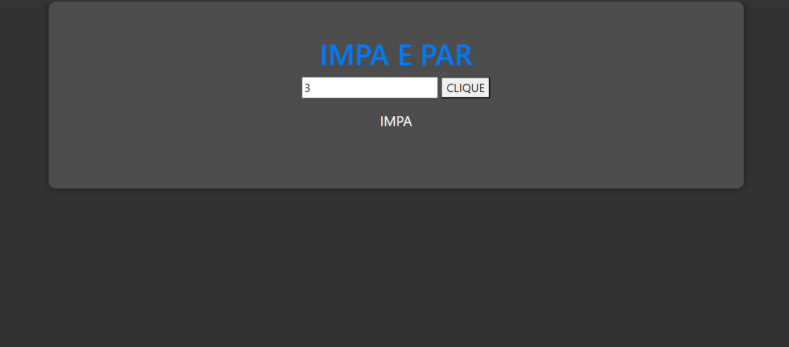
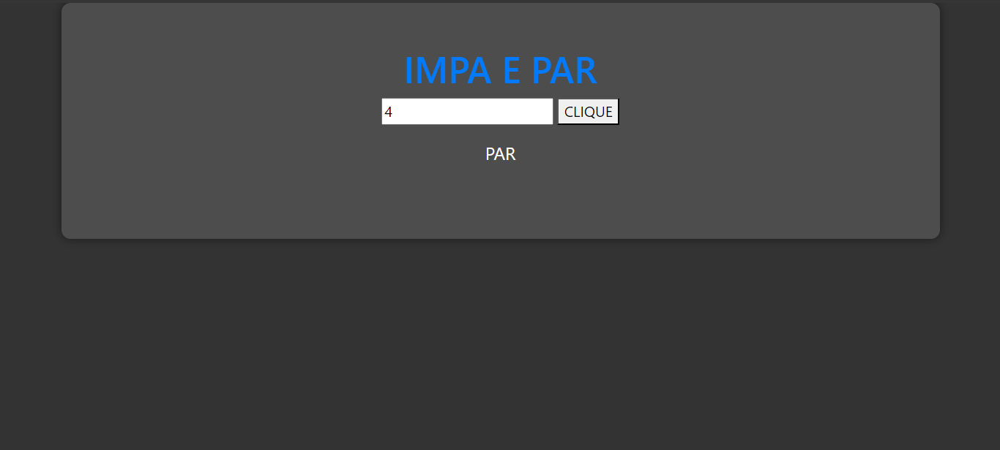

# IMPA E PAR COM PYSCRIPT
👨‍🏫PROJETO CRIADO PARA O CURSO DE PYSCRIPT.

 <br>
 <br>

## DESCRIÇÃO
O projeto "IMPA E PAR com PyScript" é uma aplicação web simples que permite ao usuário verificar se um número é par ou ímpar. Utiliza HTML, Bootstrap, SCSS para o layout e PyScript para a lógica de programação.

A página contém um campo de entrada onde o usuário pode inserir um número, seguido por um botão "CLIQUE" para verificar se o número é par ou ímpar. Ao clicar no botão, a função `my_function` é acionada, que verifica se o número inserido é par ou ímpar e exibe o resultado na página.

## EXECUTANDO O PROJETO:
1. **Apenas Executar:**
   1. Para usá-lo, basta apenas executar o arquivo: `./CODIGO/index.html` no navegador da sua preferência.
   2. Insira um número no campo de entrada.
   3. Clique no botão "CLIQUE".
   4. O resultado será exibido abaixo do botão, indicando se o número é par ou ímpar. 

2. **Editar o CSS:**
   - Para Compilar o SCSS para CSS, Apague os arquivos `./CODIGO/styles.css` e `./CODIGO/styles.css.map`, Execute o comando no terminal (Dentro do diretório `./CODIGO`):
   ```bash
   sass styles.scss styles.css
   ```

## NÃO SABE?
- Entendemos que para manipular arquivos em `HTML`, `CSS` e outras linguagens relacionadas, é necessário possuir conhecimento nessas áreas. Para auxiliar nesse aprendizado, oferecemos cursos gratuitos disponíveis:
* [CURSO DE HTML E CSS](https://github.com/VILHALVA/CURSO-DE-HTML-E-CSS)
* [CURSO DE SCSS](https://github.com/VILHALVA/CURSO-DE-SCSS)
* [CURSO DE BOOTSTRAP](https://github.com/VILHALVA/CURSO-DE-BOOTSTRAP)
* [CONFIRA MAIS CURSOS](https://github.com/VILHALVA?tab=repositories&q=+topic:CURSO)

## CREDITOS:
- [PROJETO CRIADO PARA O CURSO DE PYSCRIPT](https://github.com/VILHALVA/CURSO-DE-PYSCRIPT)
- [PROJETO FEITO PELO VILHALVA](https://github.com/VILHALVA)
